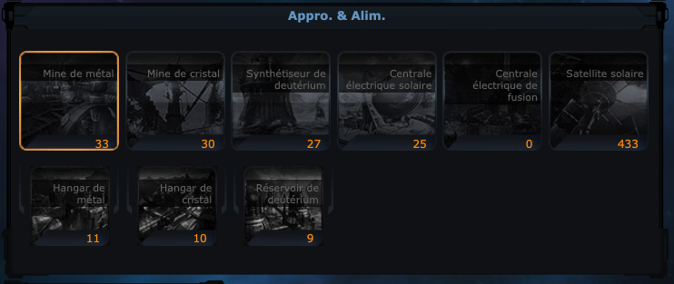
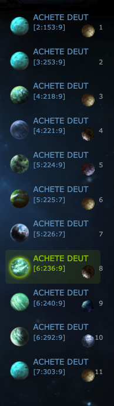
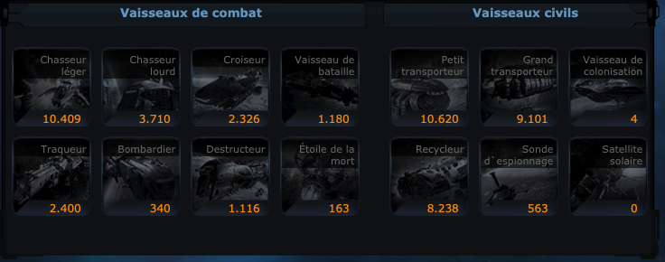

Nous allons dans ce blog aborder les fondamentaux de Ogame.

- Les différentes façon de jouer
- Les tips & trick relatif au bon début de jeu
- Les différents mots clés du jeu

Rentrons tout de suite dans le vif du sujet et ne perdons pas de temps.

Les façons de jouer ? Il existe 3 grandes familles de joueurs pour qu'ensuite chacuns des différents style de jeu dérive d'une des classes mère.

* Les Raideurs
* Les Mineurs
* Les Deutiers

Pour les Raiders nous avons les sous-catégories reconnues

* Raiders aggro
* Raiders défensif

Pour les mineurs nous avons

* Mineur aggro
* Mineur défensif (ou aussi appellé Turtle).

Et la même chose pour les Deutiers !

Jusqu'à maintenant rien de bien bien compliqué, mais poser les bases c'est toujours ce qu'il faut faire !!

Pour ma part j'ai toujours appriécié le mineur aggressif ! (C'est mon style de jeu).

Je commence l'univers sur des basae mineur, en montant toutes mes mines et en essayant de récupérer le plus de planètes possible en early game.

Par la suite quand viens le moment de former notre première EDLM (RIP), je passe Raideur !

Un joli nombre de planètes !

Une belle petite flotte !

