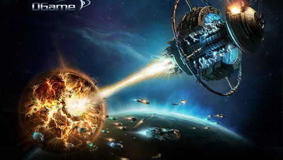
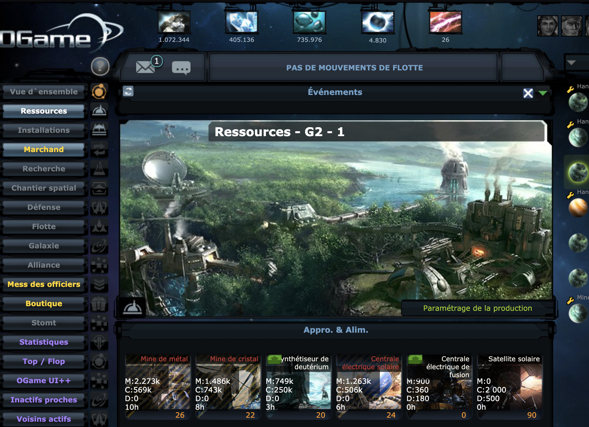
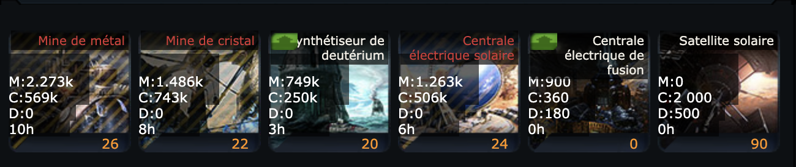

Nous allons dans ce blog aborder les fondamentaux de Ogame.

Je vais essayer dans chacun des blogs post de fournir un bon nombre d'information sur tous les différents type de gameplay auquel nous pouvons faire face durant votre sejour sur un univers et aborder:

- comment on joue ?
- Les différentes façon de jouer
- Les tips & trick relatif au bon début de jeu
- Les différents mots clés du jeu

Rentrons tout de suite dans le vif du sujet et ne perdons pas de temps ! Avant de pouvoir parler en profondeur de chaque sujet, il faut nous poser question très une simple ...

## Mais comment on joue à ce jeu ?

> Bah c'est facile tu cliques sur des icones et tu attends 😀

Sans rire, il y beaucoup de vrai dans cette petite citation, mais heuresement c'est loin d'être la seule chose que tu vas faire !

> Tu vas aussi regarder des timers et strésser quand il y aura un gros triangle rouge sur ton interface 😀

Lorsque que tu auras crée ton compte, tu arriveras sur l'interface des ressources, normalement ça devrait ressembler à cela

Pour traiter les différents style de jeu au cas par cas, il nous faut tout de même un petit aperçu de base !

Voici vos bâtiments principaux, les mines et les différents moyen de produire de l'énergie.

Le concept de base est très simple, plus le niveau de tes mines est haut que ce soit, le métal le cristal, ou le deut ... plus tu vas produire de ressources dans ce jeu on parlera toujours de production à l'heure.

## Quels sont Les façons de jouer à Ogame ?

Il existe 3 grandes familles de joueurs pour qu'ensuite chacuns des différents style de jeu dérive d'une des classes mère.

- Les Raideurs
- Les Mineurs

Pour les Raiders nous avons les sous-catégories reconnues par la communautée

- Raiders aggro
- Raiders défensif

Pour les mineurs nous avons

- Mineur aggro
- Mineur défensif (ou aussi appellé Turtle).
- Les deutiers (Je n'ai pas une grande expérience car je n'ai jamais joué de compte purement dans ce style, mais nous verrons que beaucoup de concept reste similaire, mais on détaillera quand même l'essentiel)

Jusqu'à maintenant rien de bien bien compliqué, mais poser les bases c'est toujours important !

J'ai toujours appriécié le mineur aggressif ! 😀

Un style un peu tapette en early mais qui fait vite fureur lorsque votre production de matière première devient conséquente sur chacune de vos planètes.

Je commence l'univers sur des bases minières, en montant l'intégralité des bâtiments de production et en essayant de récupérer le plus de planètes possible en early game généralement placée en X:XXX:8 ou 9 pour que celle-ci est un maximum de place. Mais nous reviendront sur le nombres de place des planètes et leur positionement dans le système solaire plus tard.

Lorsque que j'ai arrété mon compte sur Spica il avait plus de 8 millions de points.

J'ai récemment recommencer à jouer au jeu et je suis parti sur l'univers Mensa les screenshots que vous verrez à l'appuie sur les différentes catégories seront issue de ce compte.
